# 🚀 DevNest

> **A developer-focused blogging platform built with Django.**

DevNest is a modern blogging platform designed specifically for developers to create, publish, and discover technical articles. It provides a clean reading experience, role-based content management, secure authentication, and dashboard for managing blog posts.

---

## 📸 Preview


## Home Page
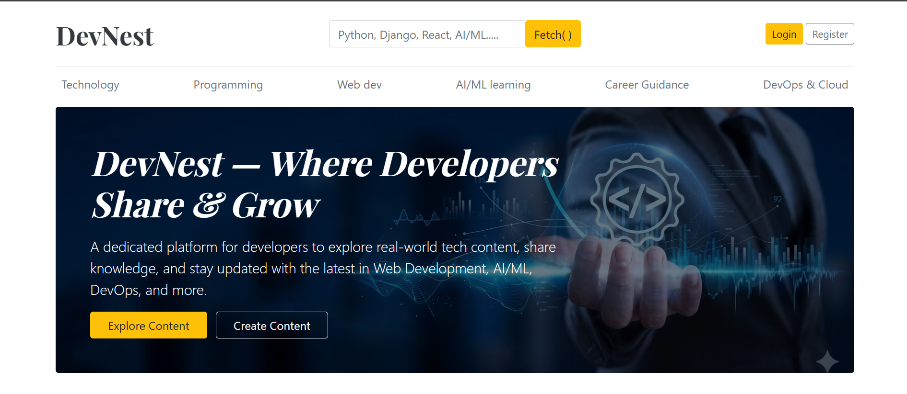  

## Login Page
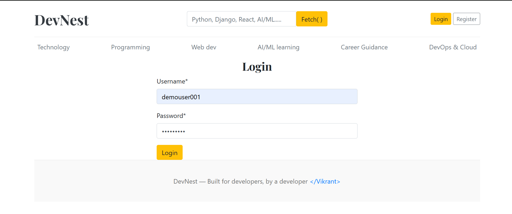

## Featured Posts
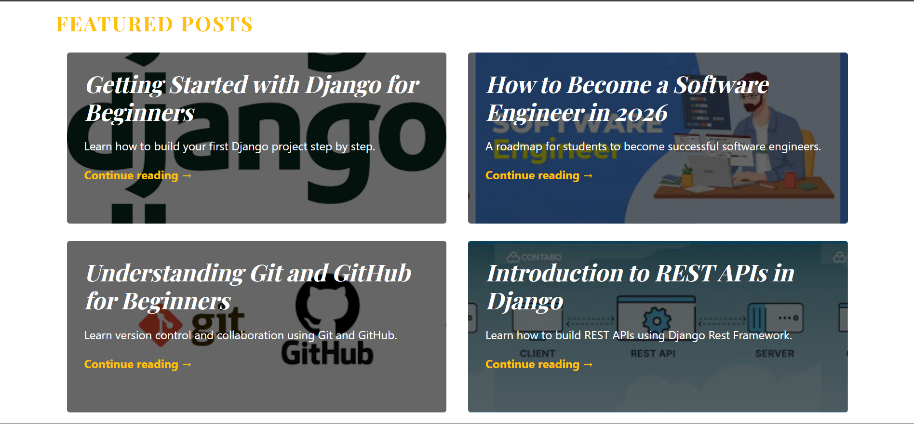

## Recent Articals
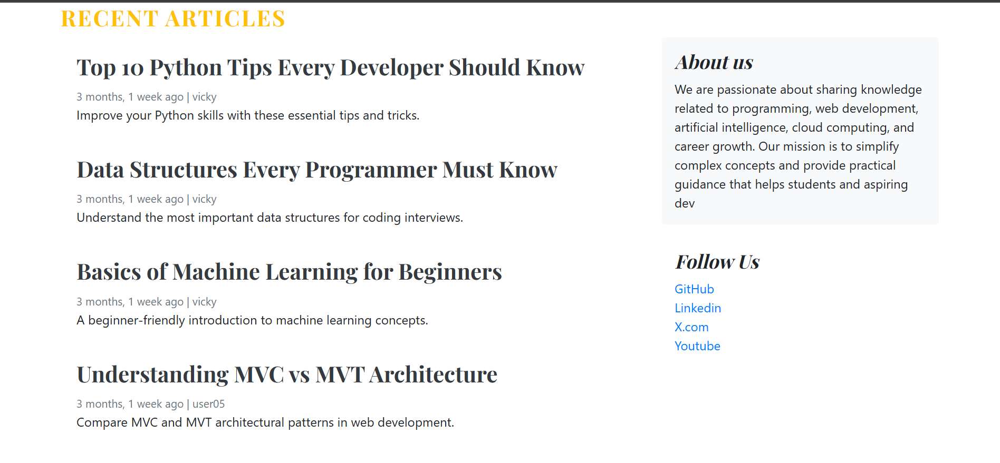

## Blog Details
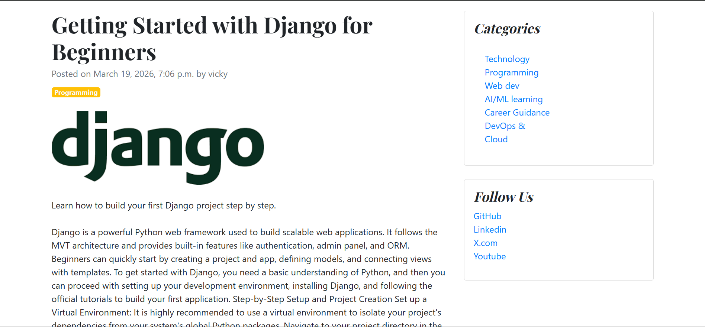

## Dashboards
As the feature of Role Based Access, User, Editor, Manager and Admin have the different Dashboard interfaces 
### User Dashboard
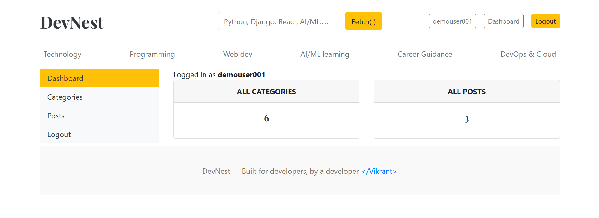
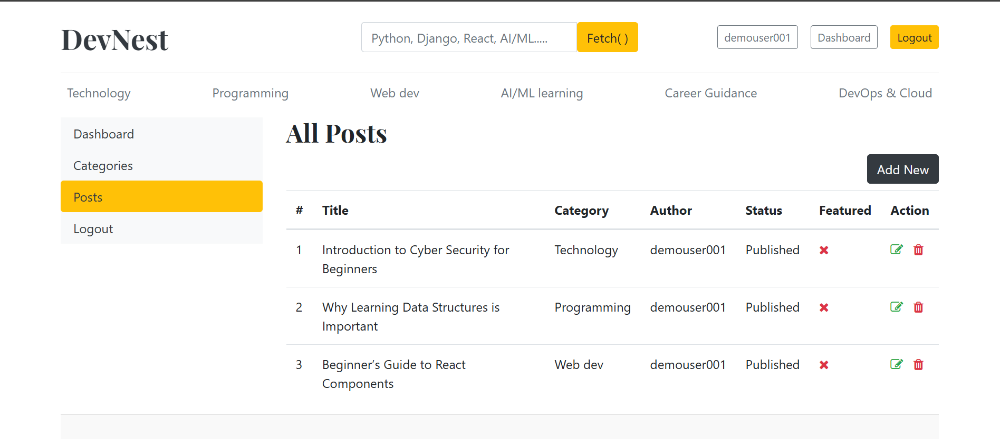

### Editor Dashboard
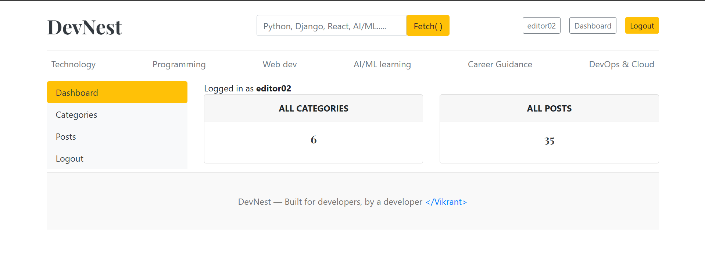


### Manager Dashboard
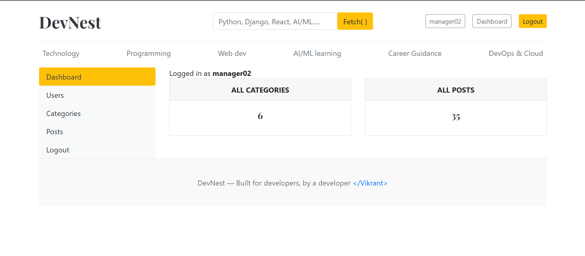
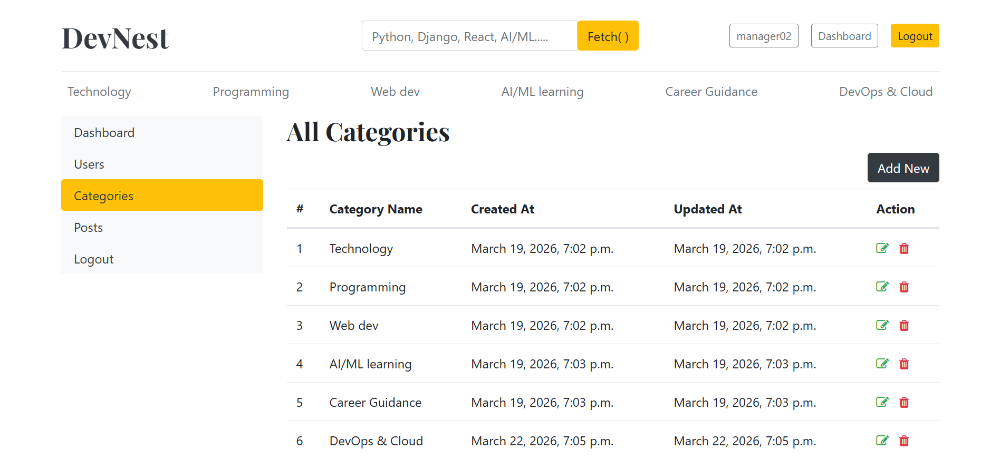
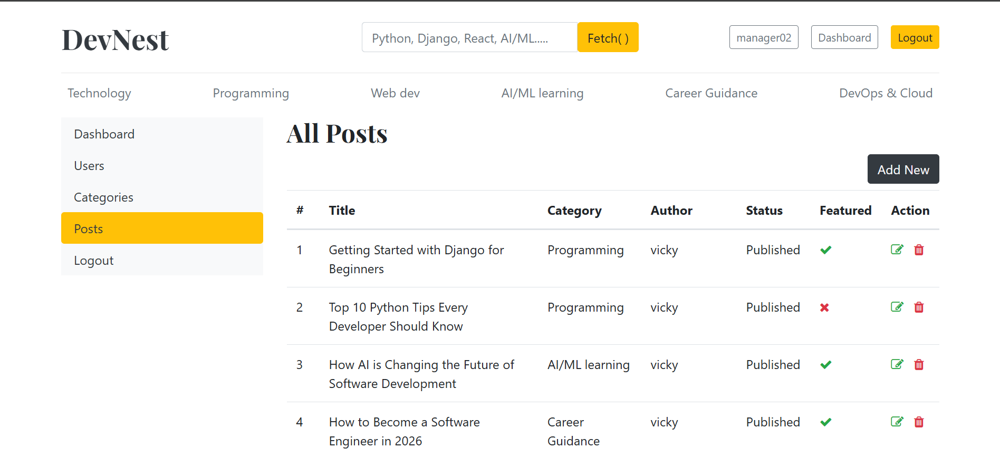
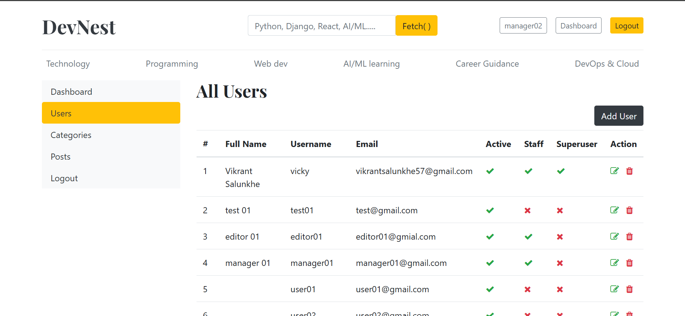

## Admin Panel
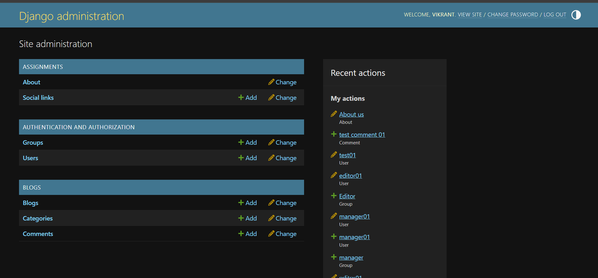

## Create Blog
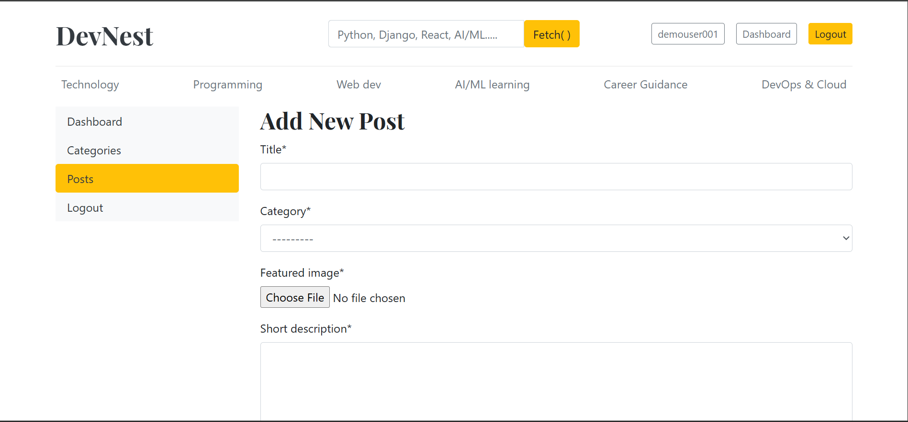

## 


---

# ✨ Features

### 👤 User Authentication

* User Registration
* Secure Login & Logout
* Password Protection
* Django Authentication System

---

### 📝 Blog Management

* Create Blog Posts
* Edit Existing Posts
* Delete Posts
* Rich Blog Content
* Upload Featured Images
* Draft & Published Status

---

### 📂 Categories

* Organize blogs by categories
* Browse category-wise articles
* Easy content discovery

---

### ⭐ Featured Posts

* Highlight important articles
* Featured section on homepage

---

### 🔍 Search

* Search blogs by title
* Quickly find relevant articles

---

### 👥 Role-Based Access

#### Reader

* Read published blogs
* Search articles
* Browse categories

#### Editor

* Create blogs
* Edit own blogs
* Manage drafts

#### Manager

* Full content management
* Manage featured posts
* Moderate published content

#### Admin

* Complete platform control
* Manage users
* Manage categories
* Manage blogs
* Django Admin Panel

---

# 🛠 Tech Stack

## Backend

* Python
* Django

## Database

* SQLite (Development)

> Can be migrated to PostgreSQL or MySQL.

## Frontend

* HTML5
* CSS3
* Bootstrap 5

## Authentication

* Django Authentication System

## Media Handling

* Django Media Files

---

# 📁 Project Structure

```
DevNest/
│
├── blog/
│   ├── migrations/
│   ├── templates/
│   ├── static/
│   ├── models.py
│   ├── views.py
│   ├── urls.py
│   ├── forms.py
│   └── admin.py
│
├── media/
├── static/
├── templates/
├── db.sqlite3
├── manage.py
├── requirements.txt
└── README.md
```

---

# ⚙ Installation

## Clone Repository

```bash
git clone https://github.com/yourusername/DevNest.git
```

```bash
cd DevNest
```

---

## Create Virtual Environment

### Windows

```bash
python -m venv venv
venv\Scripts\activate
```

### Linux / macOS

```bash
python3 -m venv venv
source venv/bin/activate
```

---

## Install Dependencies

```bash
pip install -r requirements.txt
```

---

## Apply Migrations

```bash
python manage.py makemigrations
python manage.py migrate
```

---

## Create Superuser

```bash
python manage.py createsuperuser
```

---

## Run Development Server

```bash
python manage.py runserver
```

Open your browser:

```
http://127.0.0.1:8000/
```

---

# 📦 Environment Variables

If you use a `.env` file, create one in the project root.

Example:

```env
SECRET_KEY=your-secret-key
DEBUG=True
ALLOWED_HOSTS=127.0.0.1,localhost
```

> Do **not** commit your actual `.env` file to GitHub.

---

# 🗄 Database Models

### Category

* Name
* Slug

### Blog

* Title
* Slug
* Category
* Author
* Featured Image
* Short Description
* Blog Body
* Status
* Featured
* Created Date
* Updated Date

---

# 🔒 Authentication & Authorization

The project uses Django's built-in authentication system with role-based permissions.

Supported roles:

* Reader
* Editor
* Manager
* Admin

---

# 🌟 Future Improvements

* User Profiles
* Like & Bookmark Blogs
* Dark Mode
* Email Verification
* Password Reset
* REST API
* Markdown Support
* Tags
* Reading Time Estimation
* Newsletter Subscription
* AI-powered Blog Recommendations

---

# 📚 Learning Objectives

This project helped me understand:

* Django Project Structure
* Django ORM
* Models & Relationships
* Views & URL Routing
* Templates
* Bootstrap Integration
* Authentication & Authorization
* CRUD Operations
* File Uploads
* Django Admin
* Static & Media Files
* Form Handling
* Role-Based Access Control

---

# 🤝 Contributing

Contributions are welcome!

1. Fork the repository
2. Create a new branch

```bash
git checkout -b feature/feature-name
```

3. Commit your changes

```bash
git commit -m "feat: add new feature"
```

4. Push your branch

```bash
git push origin feature/feature-name
```

5. Open a Pull Request

---


# 👨‍💻 Author

**Vikrant Salunkhe**

* MCA Student @ PCCOE
* Full Stack Developer
* Passionate about Django, MERN Stack, and AI-powered applications

If you found this project helpful, consider giving it a ⭐ on GitHub!
